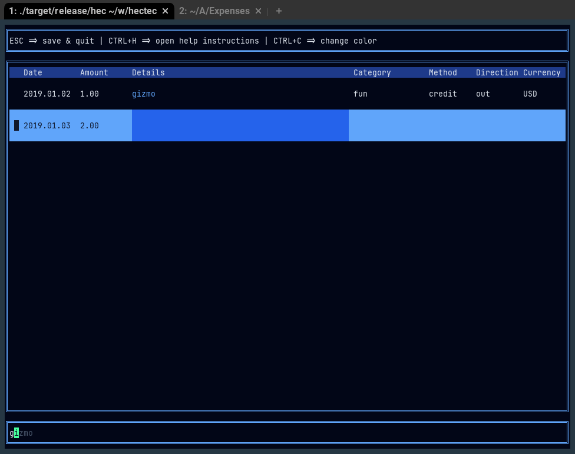

# Hectec
Manage your expenses


## Start
- Copy example_transactions.csv to whereaver you want to manage your transactions
- Build Hectec (cargo build --release)
- Run as `./target/release/hectec [path to transactions file]`
```shell
./target/release/hectec example_transactions.csv
```
- Now you can fill in your transactions

### Autofill
A main feature in the app is the auto-fill.
This works with two parts:
- When writing, the app searches for the latest cell in the same column that starts with your input
- After writing the details column, the app looks for the latest row with the same details, and will offer to complete the other cells accordingly

In order to auto-complete, just move on (TAB or ENTER).
If you want to delete the  suggested text, hit DEL.

Beware of the auto-complete when filling in the amounts, since it may complete the amount to something other than what you wanted. e.g. `200` can be completed to `2000.00`.


## Navigation
- ESC => save & quit (if the app doesn't crash, it automatically saves your changes)
- CTRL+H => toggle the help instructions window
- CTRL+C => change color (this is just because it was in the Ratatui example)
- CTRL+R => toggle between insert mode and report mode
- ↑ => one line up | ↓/ENTER => one line down (ENTER also saves the contents whereas ↓ does not)
- ENTER at last line => create new transaction and move to the date column
- SHIFT+TAB => previous-column & insert recommended text
- TAB => next-column & insert recommended text
- PgUp => go to first row | PgDn => go to last row
- CTRL+D => delete selected row
- DEL at end of text => remove recommended text
